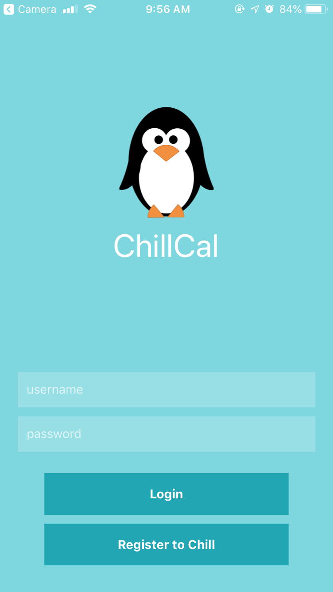
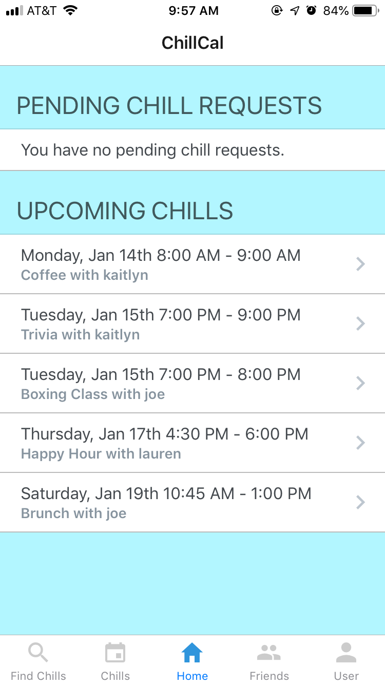
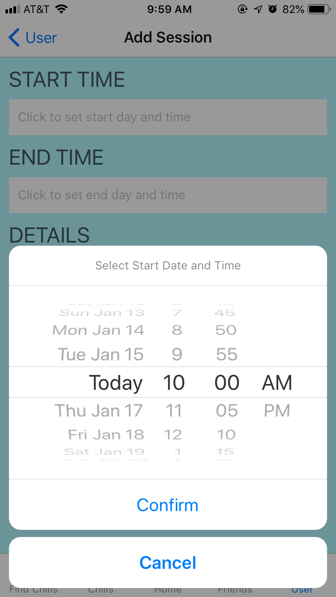
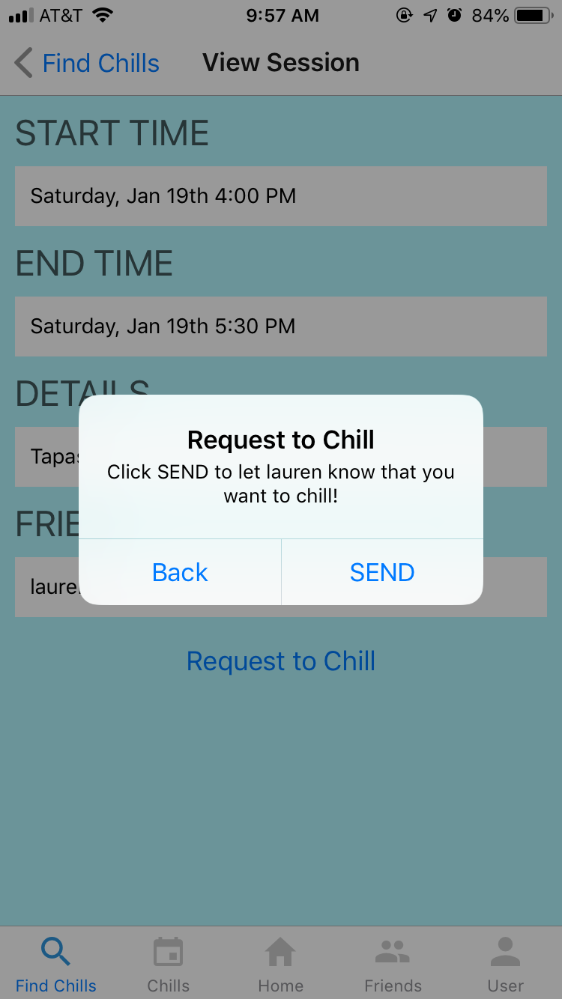

# ChillCal

ChillCal is an anti-calendar application that focuses on free time rather than busy time. A connection-based app, users enter in times where they are available and their friends may request to “chill” during those times. Complete with a wintry, penguin theme, ChillCal will be a clean, easy-to-follow web-based mobile application.

## Built With

JavaScript, Node.js, React, React-Native, Redux, Saga, Expo, PostgreSQL, Passport

This app was tested and developed on an iPhone 6s. Though it should boot on Android, the functionality and UI may not work as expected.

## Features

### Completed

- [x] Users can create an account
- [x] Users can search for friends and send connection requests
- [x] Users can accept or decline connection requests
- [x] Users can create chills and edit their created chills
- [x] Users can view friend's open chills and request to chill
- [x] Users can accept or decline chill requests
- [x] Users can view their scheduled chills
- [x] Users can cancel a scheduled chill or a chill request

### Next Steps

- [ ] Implement calendar view for chills
- [ ] Implement message feature to discuss chill details

## Screenshots
     
     

More screenshots are located in the `screenshots/` folder.

## Getting Started

### Prerequisites

Before you get started, make sure you have the following software installed on your computer:

- [Node.js](https://nodejs.org/en/)
- [PostrgeSQL](https://www.postgresql.org/)
- [Postico](https://eggerapps.at/postico/) 
- [NPM](https://www.npmjs.com/)
- [Expo](https://expo.io/)

### Installing

To get a copy of chillcal running on your local machine:

1. Download this project.
1. Install node modules using `npm install`.
1. Start client with `expo start` in a separate terminal.
1. Launch phone simulator from expo's browser window or navigate to project through expo's phone application.
1. Follow steps of [chillcal-api](https://github.com/ashklein6/chillcal-api) project to set up server. Update the url in `serverReference.js` to reflect server's location.

### Lay of the Land

* `src/` contains the React-Native application
* `assets/` contains images used in the React-Native application

## Authors

* Ashley Klein

## Acknowledgments

* Prime Digital Academy for starter code with Passport
